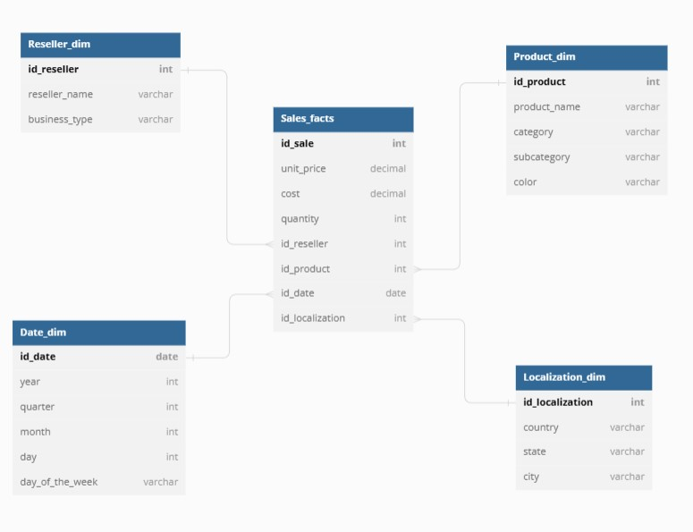

# Datawarehouse-StarSchema


Ce projet consiste à créer un data warehouse à partir d'un fichier CSV repsésentant un échantillon de la base de données AdventureWorks, qui a été récupéré sur Kaggle.

La base de données "AdventureWorks" est une base de données de test créée par Microsoft et représente les ventes au détail de produit de cyclisme d'une entreprise fictive. L'objectif du projet est donc d'analyser les ventes de cet entreprise.

Le projet implique l'utilisation de PostgreSQL pour créer le schéma, Pandas pour le traitement des données et psycopg2 pour le chargement des données dans la base de données.

Dataset link : https://www.kaggle.com/datasets/algorismus/adventure-works-in-excel-tables?select=Sales.csv


## Schéma  Base de Données


Le schéma de base de données utilisé dans ce projet est un schéma en étoile simple composé d'une table de faits et de quatre tables de dimensions. Le schéma est défini comme suit :

- Sales_facts : Une ligne de la table des faits représente la vente d'un produit. (prix unitaire, quantité, coût).
- Product_dim : la table de dimension contenant des informations sur les produits. (nom produit, catégorie, sous-catégorie, couleur)
- Reseller_dim : la table de dimension contenant des informations sur les revendeurs. (nom revendeur, type de business)
- Localization_dim : la table de dimension contenant des informations sur la localisation. (pays, departement, ville)
- Date_dim : la table de dimension contenant des informations sur les dates. (date, année, trimestre, mois, jour, jour de la semaine)





## Prérequis

- Python 3.x
- PostgreSQL

## Installation

1. Cloner le dépôt GitHub. 
2. Installer les dépendances requises(pandas et psycopg2) en exécutant la commande "pip install -r requirements.txt".
3. Créer une base de données PostgreSQL et configurer les informations de connexion dans le fichier "config.py".
4. Exécuter le script "create_tables.py" pour créer les tables dans la base de données.
5. Exécuter le script "etl.py" pour charger les données CSV dans la base de données.

## Structure du projet

- data/ : ce répertoire contient les fichier CSV contenant les données.
- config.py : ce fichier contient les informations de connexion à la base de données.
- create_tables.py : ce script crée les tables dans la base de données.
- requirements.txt : ce fichier contient la liste des dépendances requises.
- db_connection.py : permet de se connecter à la base de données PostgreSQL.
- load_X.py : ces fichiers contiennent les fonctions pour charger les données dans les tables correspondantes de la base de données.
- etl.py : ce script appelle les fonctions de chargement de données et exécute la transaction.

## Utilisation

Une fois les données chargées dans la base de données, vous pouvez exécuter des requêtes SQL pour analyser les données et obtenir des informations sur les ventes de produits.

Par exemple, pour obtenir le chiffre d'affaires total par pays :

```sql
SELECT l.country, SUM(f.unit_price * f.quantity) as total_sales
FROM "Sales_facts" f, "Localization_dim" l
WHERE f.id_localization = l.id_localization
GROUP BY l.country
ORDER BY total_sales DESC;

```
## Licence 

Les données utilisées dans ce projet proviennent de la base de données AdventureWorks de Microsoft, sous licence GNU Lesser General Public License 3.0. Le jeu de données a été obtenu à partir de Kaggle, et vous pouvez trouver plus d'informations sur la licence dans la page Kaggle correspondante. Vous trouverez le lien vers la page dans l'introduction du fichier readme.

## Authors

1. Skander JMAIEL
2. Aboubacar CAMARA
3. Islam MASSAT
4. Marius GUITTON-FRANTZ
