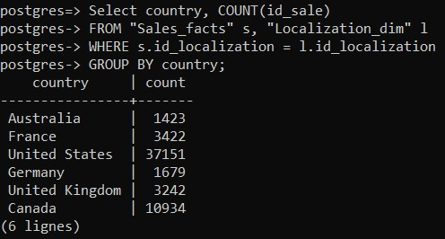
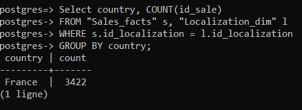

# Contrôle d'accès
### Création d'un utilisateur
La requête suivante permet de créer un utilisateur nommé jhonDoe avec le mot de passe password :

```sql
CREATE USER jhonDoe WITH PASSWORD 'password';
```
### Création d'un rôle
La requête suivante permet de créer un rôle nommé user_readonly :

```sql
CREATE ROLE user_readonly;
```
### Donner des droits à un rôle
Les requêtes suivantes permetent de donner au rôle user_readonly le droit de lecture sur les tables de notre schéma en étoile, la dernière requête permet au rôle user_readonly de se connecter à la base de données :

```sql
GRANT SELECT ON TABLE "public"."Date_dim" TO user_readonly;
GRANT SELECT ON TABLE "public"."Product_dim" TO user_readonly;
GRANT SELECT ON TABLE "public"."Localization_dim" TO user_readonly;
GRANT SELECT ON TABLE "public"."Reseller_dim" TO user_readonly;
GRANT SELECT ON TABLE "public"."Sales_facts" TO user_readonly;
GRANT CONNECT ON DATABASE postgres TO user_readonly;

```

### Donner un rôle à un utilisateur
La requête suivante permet de donner le rôle user_readonly à l'utilisateur jhonDoe :

```sql
GRANT user_readonly TO jhonDoe;
```

# Virtual Private Databases - VPD

## Configuration du paramère "app.user_country" pour l'utilisateur "jhonDoe"

```sql
ALTER USER jhonDoe SET app.user_country = 'France';
```
## Politique de sécurité sur la table "Sales_facts"
la requête suivante permet de créer une politique de sécurité pour la table sales_facts qui affiche les données qui correspondent aux pays de l'utilisateur courant :

```sql
CREATE POLICY sales_facts_policy
ON "Sales_facts"
USING (EXISTS (SELECT 1 FROM "Localization_dim" 
WHERE "Localization_dim"."id_localization" = "Sales_facts"."id_localization"
AND "Localization_dim"."country" = current_setting('app.user_country')))
WITH CHECK (true);
```
## Activation de la politique de sécurité
la requête suivante active la politique de sécurité pour la table "Sales_facts" : 

```sql
ALTER TABLE "Sales_facts" ENABLE ROW LEVEL SECURITY;
```
## Tester la politique de sécurité mise en place
On execute cette requête avant d'activer la politique de sécurité et après l'avoir activé. La requête permet d'afficher le nombre total de vente pour chaque pays :

```sql
Select country, COUNT(id_sale)
FROM "Sales_facts" s, "Localization_dim" l
WHERE s.id_localization = l.id_localization
GROUP BY country;
```
### Avant activation
La requête prend en compte tous les pays de la base de données.



### Après activation
La requête ne prend en compte que la France, le pays de l'utilisateur courant(jhondoe).



